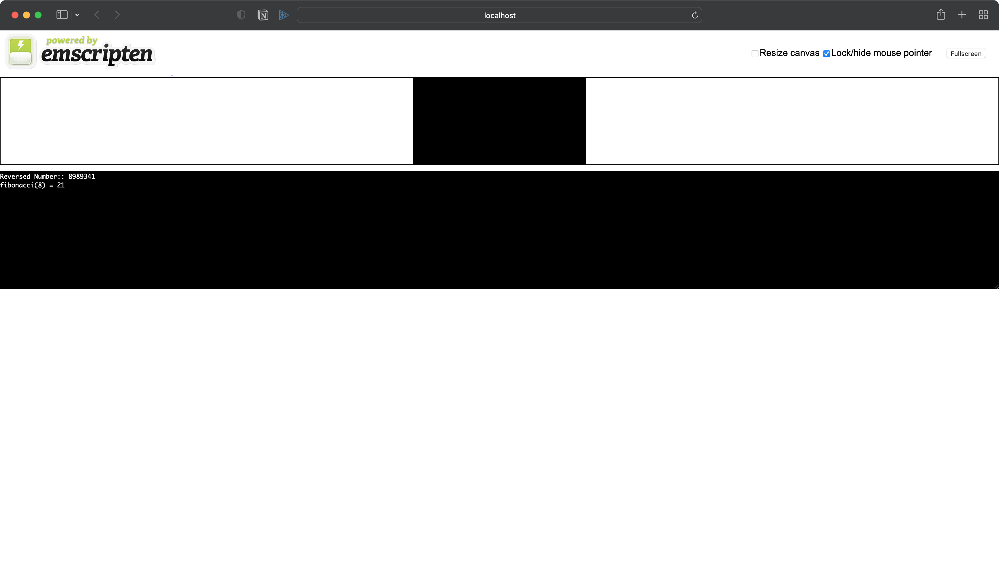

# wasm-cpp-example
This repository introduces a very basic example of WASM C++.

## Install `emsdk`

----
```bash
# Get the emsdk repo
$ git clone https://github.com/emscripten-core/emsdk.git

# Enter that directory
$ cd emsdk

# Fetch the latest version of the emsdk (not needed the first time you clone)
$ git pull

# Download and install the latest SDK tools.
$ ./emsdk install latest

# Make the "latest" SDK "active" for the current user. (writes .emscripten file)
$ ./emsdk activate latest

# Activate PATH and other environment variables in the current terminal
$ source ./emsdk_env.sh

# Check installtino
$ emcc -v
```

### Let's compile

---

```bash
$ emcc main.cpp -s WASM=1 -o index.html
```

Some wasm related files are generated by the compiler, which is shown like the image below.


### Let's run it

----
```angular2html
$ emrun --port 8080 .
```

Running the server would look like...



For more information on `emscripten`, please visit the [official documentation site](https://emscripten.org/index.html).